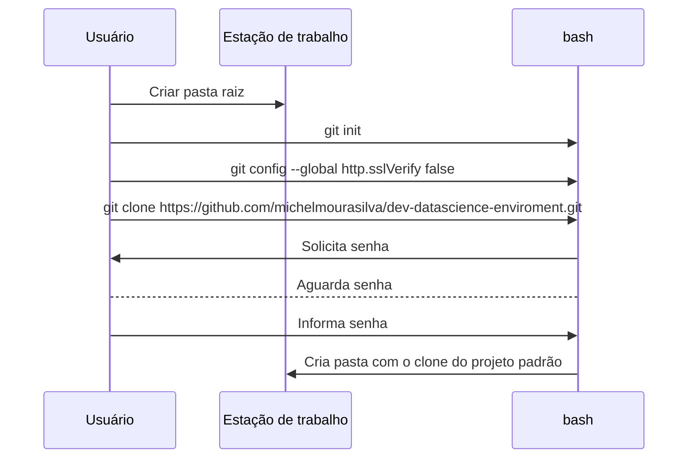

# Ambiente de desenvolvimento para ciência de dados

Ambiente criado para unificar e padronizar o ambiente de desenvolvimento e análise exploratória que deverá ser utilizado pela equipe de ciência de dados. 

Docker será utilizado para isolar o ambiente em um contêiner. Como não é necessário um hypervisor, o contêiner é mais leve e ocupa menos espaço já que não possui a necessidade de uma cópia completa do sistema operacional para funcionar já que no contêiner o kernel e suas bibliotecas são compartilhadas com o seu hospedeiro.

A imagem base para esses contêineres será do Jupiter Lab, porém será adicionado algumas bibliotecas e plugins necessários para as atividades da equipe (verificar na wiki quais são as bibliotecas que serão instaladas por padrão) . Existe um padrão de pastas e arquivos que deverá ser seguido (verificar na wiki o significado e utilização de cada pasta e arquivo) 

## Instalação

Inicialmente deverá ter instalado na estação de trabalho o Git (https://git-scm.com/)  e o Docker (www.docker.com).

Após a instalação destes aplicativos, a instalação do projeto poderá ser iniciada.

Os passos abaixo foram feitos em ambiente Windows porém os mesmos passos poderão ser feitos no Linux substituindo os endereços de pasta para o formato do sistema operacional.


## Criação das pastas do projeto

 1. Criar uma pasta na estação de trabalho para armazenar o projeto modelo. Ex: C:\projetos\

## Git

Entrar na pasta raiz criada e fazer o clone do projeto. 

 - Abrir  o bash na pasta criada. ex da linha de comando: `"C:\Program Files\Git\git-bash.exe" --cd=c:\projetos\`
 - Executar na ordem:
	 1. `git config --global http.sslVerify false`
	 2. `git clone https://github.com/michelmourasilva/dev-datascience-enviroment.git`
	 3. Será solicitado o usuário e senha caso esteja realizando os passos pela primeira vez	

Após seguir estes passos será criado uma pasta com o projeto modelo na pasta raiz. Ex: c:\projetos\dev-datascience-enviroment

## Criação do ambiente de desenvolvimento para um projeto

Abrir o bash na pasta do projeto padrão. ex: `"C:\Program Files\Git\git-bash.exe" --cd=C:\projetos\dev-datascience-enviroment` 

- Executar no bash: `./install.sh`
- Será solicitado o nome do projeto que será criado
- Processo de criação da imagem e do container do projeto será iniciado. 

 
## Inicialização do ambiente do projeto

- Primeiramente caso seja necessário a instalação de alguma biblioteca que não esteja na instalação padrão (verificar na wiki quais são as bibliotecas que serão instaladas) alterar o arquivo `requirementes.txt` antes da inicialização do ambiente. As bibliotecas nesse arquivo irão ser instaladas no contêiner do projeto sempre que ele for iniciado.

Abrir o bash na pasta do projeto criado. ex: para o projeto com nome PROJETO1 `"C:\Program Files\Git\git-bash.exe" --cd=C:\projetos\projeto1` 
- Executar no bash: `./start.sh`
- `Ambiente será iniciado e no final do terminal será apresentado a URL que deverá ser copiada e colada no browser de preferência

# Atualização
- Executar no bash `./update.sh`

# Fluxo de instalação

Clone do projeto padrão

Inicialização do projeto
 ```mermaid
 sequenceDiagram
Usuário->>bash: ./install.sh
bash->>Usuário: Solicita nome do projeto
bash-->Usuário: Aguarda nome do projeto
Usuário->bash: Informa nome do projeto
bash->>Estação de trabalho: Duplica a pasta do projeto padrão
bash->>Estação de trabalho: Renomeia a pasta do projeto padrão
bash->>Docker: Cria imagem 
bash->>Docker: Cria container do projeto
bash-xUsuário: Informa finalização da criação do ambiente do projeto
Usuário->>bash: ./start.sh
bash->>Docker: Inicializa container
Docker->>bash: Informa URL do ambiente de desenvolvimento
Usuário->>bash: Copia URL do bash
Usuário->>browser: Ir a URL copiada

```

## Visão Geral


Ambiente em contêiner utilizando Docker contendo uma versão do JupiterLab. Este ambiente visa o isolamento das dependências do sistema operacional que são necessárias para a execução da aplicação, com isso se evita o problema de configuração do ambiente tornando o processo pra inicio das atividades muito mais rápido.

## Jupyter Lab
Um Notebook Jupyter é um ambiente computacional web para a internet rica para criação de documentos para a plataforma Jupyter. O termo "notebook" pode, dependendo do contexto, fazer referência a entidades distintas como Jupyter (aplicativo Web), Jupyter Python (servidor Web) ou ao formato de documento para a plataforma. Um documento Jupyter Notebook é estruturado formato JSON, contendo uma lista ordenada de células de entrada / saída que podem conter código, texto (usando [Markdown]), matemática, gráficos e texto enriquecido, geralmente terminando com a extensão ".ipynb". [[1]]

## Extensões
Fundamentalmente, o JupyterLab foi projetado como um ambiente extensível. As extensões do JupyterLab podem personalizar ou aprimorar qualquer parte do JupyterLab. Eles podem fornecer novos temas, visualizadores e editores de arquivos ou renderizadores para saídas ricas em blocos de notas. As extensões podem adicionar itens ao menu ou paleta de comandos, atalhos de teclado ou configurações no sistema de configurações. As extensões podem fornecer uma API para outras extensões usarem e podem depender de outras extensões. Na verdade, todo o JupyterLab em si é simplesmente uma coleção de extensões que não são mais poderosas ou privilegiadas do que qualquer extensão personalizada. [[2]]


## Organização diretório de trabalho


    Projeto
    ├── CHANGELOG.md                        # Registros de alteração do repositório
    ├── README.md                        	# Informações importantes do projeto
    ├── CONTRIBUTING.md                     # Manual de como contruir para o projeto ou para o repositório do projeto
    ├── requirements.txt                    # Bibliotecas extras que irão ser instaladas no ambiente do projeto
    ├── Dockerfile                    	# Docker file 
    ├── install.sh                    	# Arquivo batch quer irá instalar o ambiente do projeto
    ├── update.sh                   	# Atualiza o conteúdo das pastas, renova containers e imagens do docker
    ├── start.sh                   		# Arquivo batch que inicia o ambiente
    ├── workdir                   		# Diretório de trabalho do projeto
    │   ├── data-sets			# Diretório com fontes de dados necessárias para testes ou análise exploratória
    │   │   ├── externos			# Dados de origem de terceiros
    │   │   ├── intermediario		# Dados intermediários que foram transformados
    │   │   ├── processado			# Os conjuntos de dados canônicos finais para modelagem
    │   │   ├── raw				# Dump dos dados original e imutável.
    │   ├── doc				# Informações sobre os dados e negócio
    │   │   ├── dicionario_dados		# Dicionário das fontes de dados utilizadas no projeto
    │   │   ├── manuals			# Manuais diversos
    │   │   ├── outros			# Qualquer documento q seja importante para o projeto
    │   │   ├── wiki			# Repositório das páginas da wiki do projeto
    │   ├── modules				# Scripts/módulos que podem ser reutilizados em um ou mais projetos. Obs: Verificar notebook na pasta /notebooks/common_exames/UsoModulosComuns.ipynb que mostra um exemplo de como proceder.
    │   │   ├── common			# Scripts comuns entre os projetos. Essa pasta será atualizada através do script update_common_files.sh.
    │   │   ├── scripts			# Scripts python utilizados no projeto. Ex: APis, modelos de ML, etc
    │   ├── notebooks			# Notebooks específicos do projeto e alguns exemplos.
    │   │   ├── common_examples		# Base de conhecimento contendo exemplos de notebooks que podem ser utilizados em todos os projetos
    │   ├── Relatorios			# Análise gerada como HTML, PDF, LaTeX, etc.
    │   │   ├── imagens			# Gráficos e figuras geradas para serem usados ​​em relatórios ou até em outros pontos do projeto
    │   ├── tests				# Diretório para armazenar scripts ou notebooks voltados somente a testes de outros scripts ou de outros notebooks.
    ├── api                   		# Repositório do modelo de API Rest utilizando FastAPI
    │   ├── .devcontainer			# Conjunto de definições de contêiner de desenvolvimento
    │   │   ├── devcontainer.json		# Arquivo de configuração do contêiner
    │   │   ├── docker-compose.yml		# Arquivo docker compose para ser utilizado no ambiente de desenvolvimento
    │   │   ├── docker-compose-prd.yml	# Arquivo docker compose para ser utilizado em ambientes de produção
    │   ├── .vscode				# Contêm configurações, configurações de tarefas e configurações de depuração
    │   │   ├── launch.json			# Configurações de execução e depuração
    │   │   ├── settings.json		# Configurações de extensão para linters e ferramentas de formatação de código para impor as regras de linguagem usadas neste repo
    │   ├── src				# Código da API
    │   ├── ├── requirements.txt		# Bibliotecas que são necessárias dentro da Api
    │   ├── ├── env.py			# Recupera as variáveis de ambiente para serem utilizadas dentro da Api
    │   ├── ├── app                   	# Aplicação dentro da Api
    │   ├── ├── ├── controller		# Arquivo que conterá os controles da aplicação. É aonde é definido os endpoints e suas ações
    │   ├── ├── ├── core			# Configurações necessárias para Api
    │   ├── ├── ├── ├── database.py		# Conexão com o banco de dados. 
    │   ├── ├── ├── models			# Modelos das entidades que serão manipuladas dentro da API. Geralmente é aonde fica o mapeamento do banco de dados
    │   ├── ├── ├── schemas			# Modelos que serão utilizados como interface entre as estruturas de banco e os controles da api. É aonde fica toda verificação de estrutura de dados
    │   ├── ├── ├── services		# Manipulação (inserção, deleção, atualização, consulta) dos objetos mapeados no models.
    │   ├── ├── ├── ├── enumerators.py	# enumerações são criadas definindo-se explicitamente os elementos com o uso da palavra-chave enum 	
    │   ├── ├── ├── tests			# Scripts para serem utilizados em testes unitários.
    │   ├── ├── ├── main.py			# Arquivo inicial da API
    │   ├── .gitingore			# Contêm o que pastas ou arquivos deverão ser ignorados no momento do push
    │   ├── docker-compose.yml		# Arquivo do orquestrador de containers do Docker
    │   ├── Dockerfile			# documento de texto que contém todos os comandos que um usuário pode chamar na linha de comando para montar uma imagem
    │   ├── README.md			# Informações importantes da Api


# Python
O ambiente está utilizando a versão do Python 3.8.5

## Bibliotecas
As bibliotecas listadas abaixo já estão instaladas por padrão no ambiente:

- numpy==1.20.1
- pandas==1.2.3
- SciPy==1.6.1
- StatsModels==0.12.2
- Matplotlib==3.3.4
- Seaborn==0.11.1
- Plotly==4.14.3
- Bokeh==2.3.0
- Pydot==1.4.2
- Scikit-learn==0.24.1
- Scrapy==2.4.1
- Requests==2.24.0
- beautifulsoup4==4.9.3
- df2gspread==1.0.4
- oauthlib==3.1.0
- gspread==3.7.0
- kafka-python==2.0.2
- black==20.8b1
- isort==5.7.0
- psycopg2-binary==2.8.6
- pandas-profiling==2.11.0
- diagrams==0.19.1


